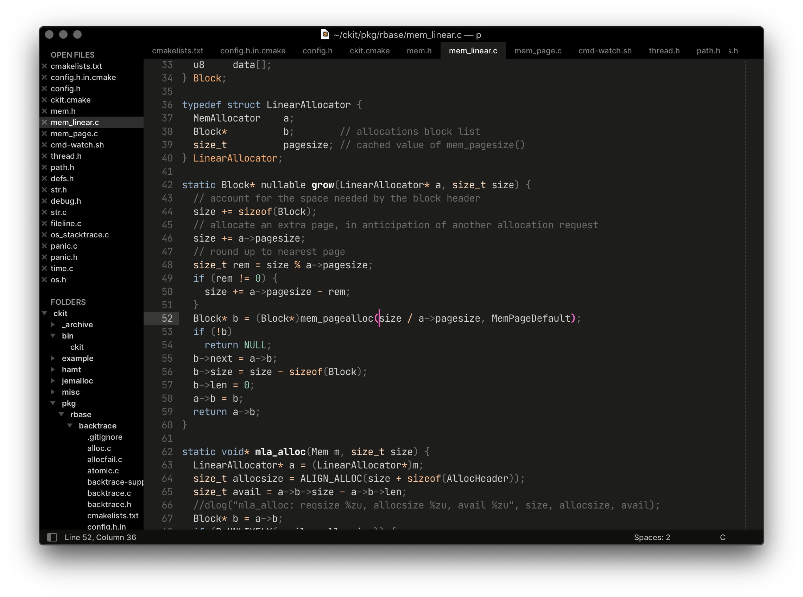
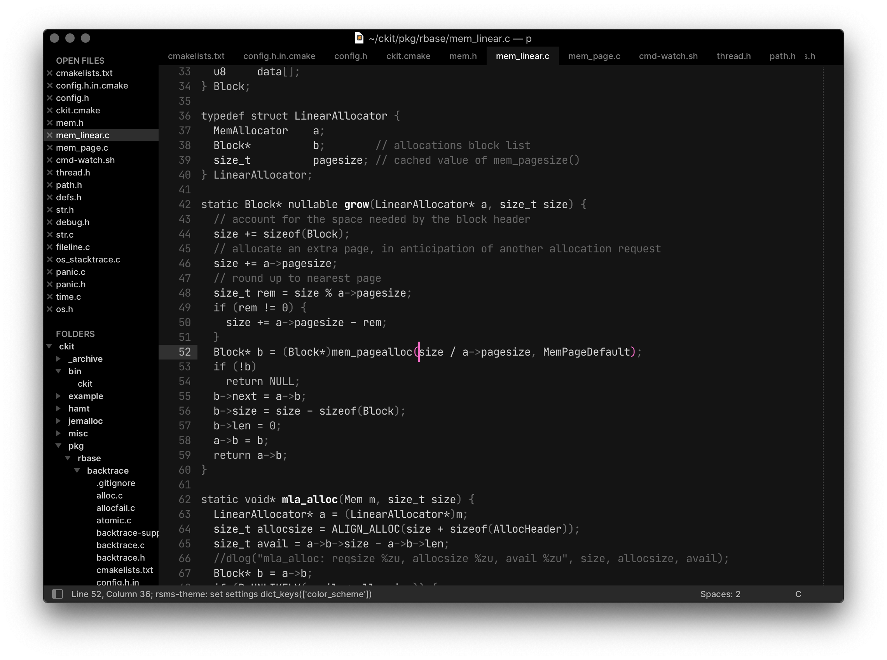
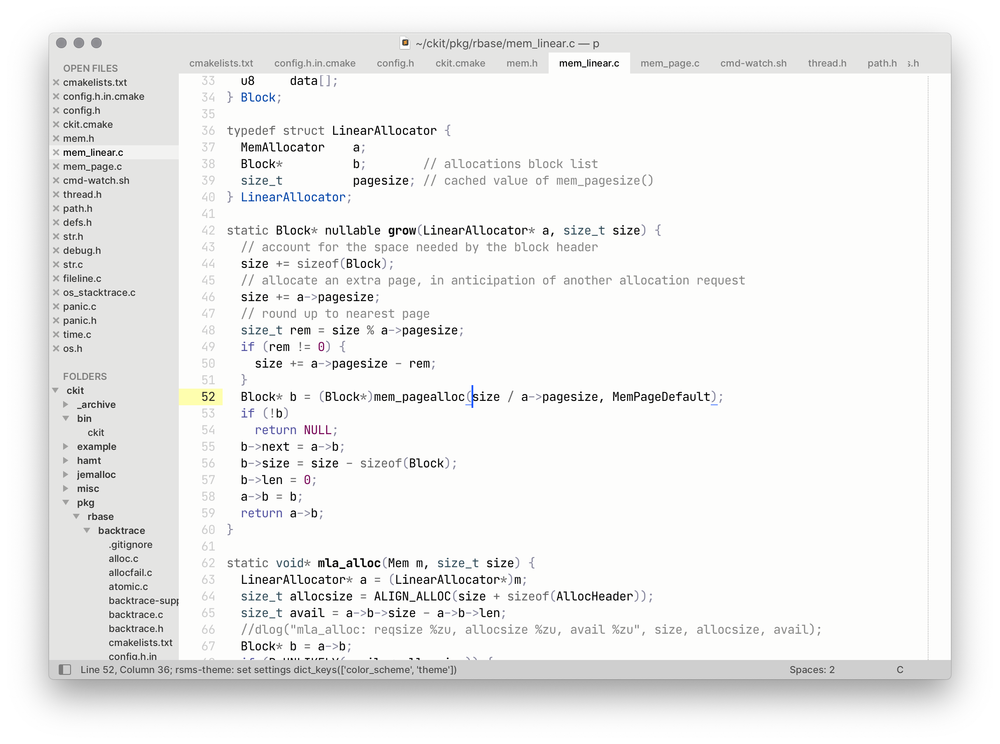

# rsms sublime text theme

The original theme can be found at [rsms/sublime-theme](https://github.com/rsms/sublime-theme), this is just a simple fork with a few additions for the sidebar. 

All credits to the original author [rsms](https://github.com/rsms)

Install:

```sh
cd path/to/your/sublime/packages
git clone https://github.com/barelyhuman/sublime-theme-rsms.git rsms-theme
```

You'll also need the fonts
[Hermit](https://pcaro.es/hermit/)
[Inter](https://rsms.me/inter/) and
installed on your system, which are used by the UI theme.


## Use

Open the command prompt in Sublime (⇧⌘P), type "rsms:" and select an option.

- `lights off` — enable dark theme
- `lights on` — enable bright theme
- `select theme...` — quickly preview the themes
- `toggle dark/light` — toggle. Shortcut: ⌥⌘L


### Recommended settings

In your `Packages/User/Preferences.sublime-settings`:

```js
"font_face": "JetBrains Mono",
"font_size": 14.0,
"font_options": [ "no_calt" ],
"line_padding_bottom": 1,
"line_padding_top": 0,
"highlight_line": false,
"show_tab_close_buttons": false,
"fold_buttons": false,
```

When in fullscreen, the square tab styles works much better than the default rounded ones:

```js
"file_tab_style": "square",
```


## Examples

<br>
<br>

